# SRT411A0
Joy Chowdhury  
January 30, 2017  

<h4 style="color:red;">ToDo1</h4>

```r
(2017-2016)/(2017-1995)*100
```

```
## [1] 4.545455
```

<h4 style="color:red;">ToDo2</h4>

```r
college.years <- 2017-2016
life.years <- 2017-1995
percentage.college.life <- college.years/life.years*100
```

<h4 style="color:red;">ToDo3</h4>

```r
sum(c(4, 5, 8, 11))
```

```
## [1] 28
```

<h4 style="color:red;">ToDo4</h4>

```r
plot(rnorm(100))
```

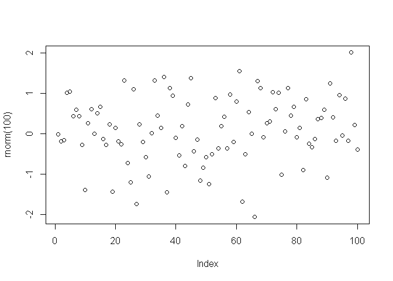<!-- -->

<h4 style="color:red;">ToDo5</h4>

```r
help(sqrt)
```

```
## starting httpd help server ...
```

```
##  done
```

<h4 style="color:red;">ToDo6</h4>

```r
file.create("firstscript.R")
```

```
## [1] TRUE
```

```r
writeLines(text = "plot(rnorm(100))", con = "firstscript.R")
source("firstscript.R")
```

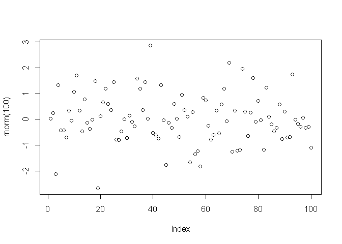<!-- -->

```r
source("firstscript.R")
```

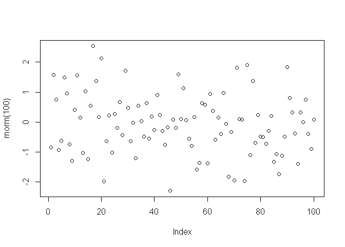<!-- -->

```r
source("firstscript.R")
```

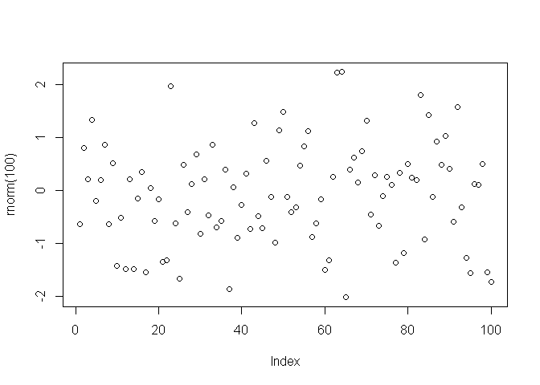<!-- -->

```r
source("firstscript.R")
```

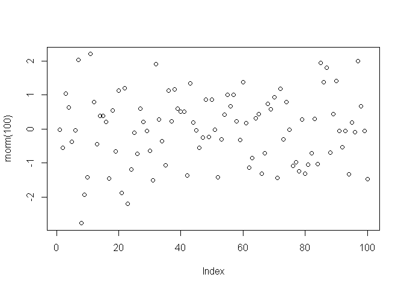<!-- -->

```r
source("firstscript.R")
```

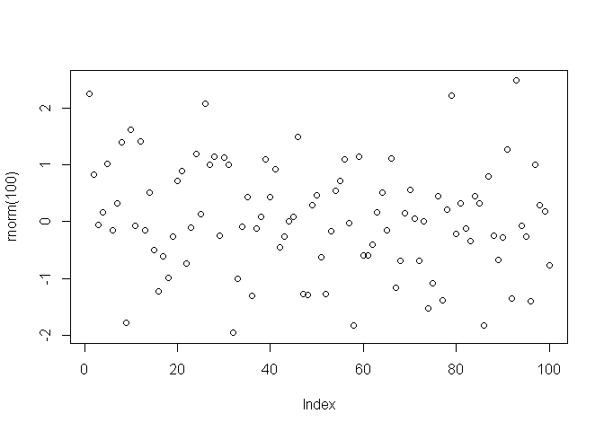<!-- -->

<h4 style="color:red;">ToDo7</h4>

```r
matrix(seq(from = 31, to = 60, length.out = 30), nrow = 6, ncol = 5)
```

```
##      [,1] [,2] [,3] [,4] [,5]
## [1,]   31   37   43   49   55
## [2,]   32   38   44   50   56
## [3,]   33   39   45   51   57
## [4,]   34   40   46   52   58
## [5,]   35   41   47   53   59
## [6,]   36   42   48   54   60
```

<h4 style="color:red;">ToDo8</h4>

```r
file.create("ToDo8.R")
```

```
## [1] TRUE
```

```r
writeLines("x1 = rnorm(100)
           x2 = rnorm(100)
           x3 = rnorm(100)
           t = data.frame(a = x1, b = x1 + x2, c = x1 + x2 + x3)
           plot(t, ask = F)
           print(sd(unlist(t)))", con = "ToDo8.R", sep="\n")
source("ToDo8.R")
```

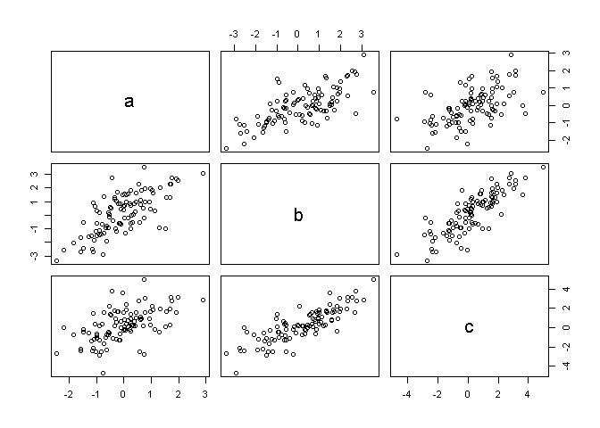<!-- -->

```
## [1] 1.422338
```

```r
#The results show several scatter plot diagrams of all the possible permutations between the three
#axial values.  The standard deviation can only read unlisted vectors so the data frame must be
#unlisted.  It represents the degree of variance among all the elements in the data frame.
source("ToDo8.R")
```

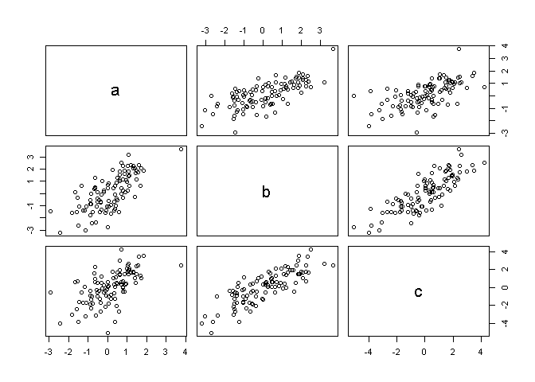<!-- -->

```
## [1] 1.46557
```

```r
source("ToDo8.R")
```

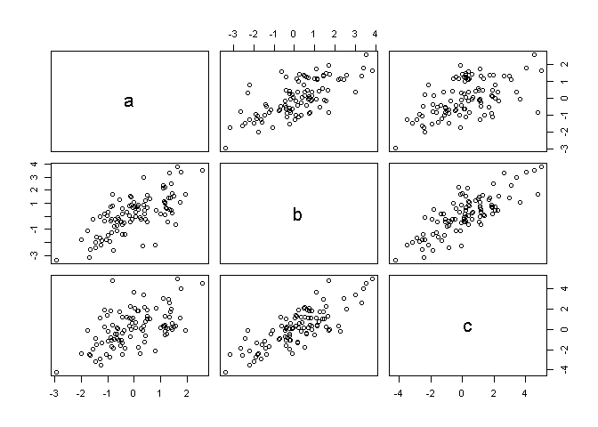<!-- -->

```
## [1] 1.482544
```

```r
source("ToDo8.R")
```

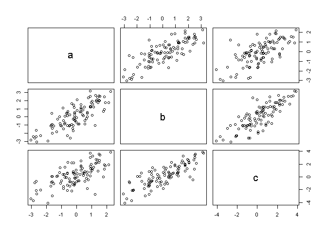<!-- -->

```
## [1] 1.487951
```

```r
source("ToDo8.R")
```

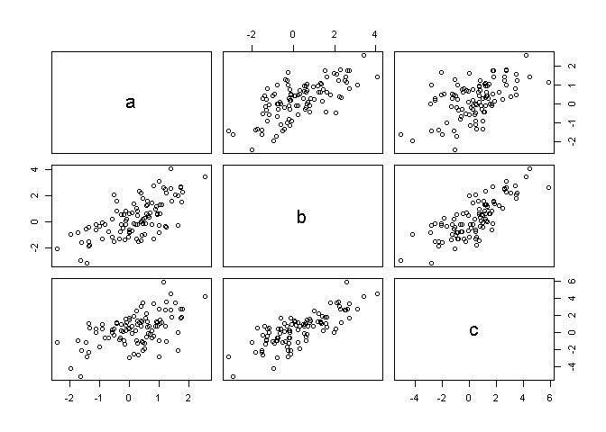<!-- -->

```
## [1] 1.457749
```

<h4 style="color:red;">ToDo9</h4>

```r
file.create("ToDo9.R")
```

```
## [1] TRUE
```

```r
writeLines("x1 = rnorm(100)
           x2 = rnorm(100)
           x3 = rnorm(100)
           t = data.frame(a = x1, b = x1 + x2, c = x1 + x2 + x3)
           plot(t$a, type = 'l', ylim = range(t), lwd = 3, col = rgb(1, 0, 0, 0.3))
           lines(t$b, type = 's', lwd = 2, col = rgb(0.3,0.4,0.3,0.9))
           points(t$c, pch = 20, cex = 4, col = rgb(0, 0, 1, 0.3))", con = "ToDo9.R", sep = "\n")
source("ToDo9.R")
```

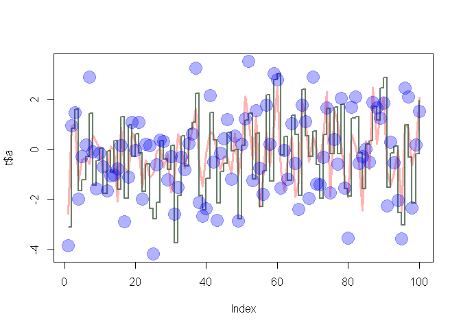<!-- -->

```r
#rgb stands for red green blue primaries which are colour specifications for a certain object.
#The object is coloured corresponding to the given intensity of each primary.
#The last arguement of rgb is alpha, which is are semi-transparent colours that are supported
#by only some devices.
#lwd is the line width, defaulting to 1.
#pch is the plotting character/symbol to use for each point.  The integer refers to a graphics symbol.
#cex is the arguement for character expansion that sets the scale for the symbol specified by pch.
```

<h4 style="color:red;">ToDo10</h4>

```r
file.create("tst1.txt")
```

```
## [1] TRUE
```

```r
write.table(data.frame(a = c(1, 2, 4, 8, 16, 32), 
                       g = c(2, 4, 8, 16, 32, 64), 
                       x = c(3, 6, 12, 24, 48, 96)), file = "tst1.txt", row.names = F)
d <- read.table(file = "tst1.txt", header = TRUE)
d$g <- d$g * 5
write.table(d, file = "tst2.txt", row.names = F)
```

<h4 style="color:red;">ToDo11</h4>

```r
mean(sqrt(rnorm(100)))
```

```
## Warning in sqrt(rnorm(100)): NaNs produced
```

```
## [1] NaN
```

```r
#NaN values are produced among some of the elements because the a square root of a negative was calculated.
```

<h4 style="color:red;">ToDo12</h4>

```r
dates = strptime(c("20170130", "20171101", "20171230"), format = "%Y%m%d")
num.presents = c(0, 1, 0)
barplot(num.presents, names.arg = dates)
```

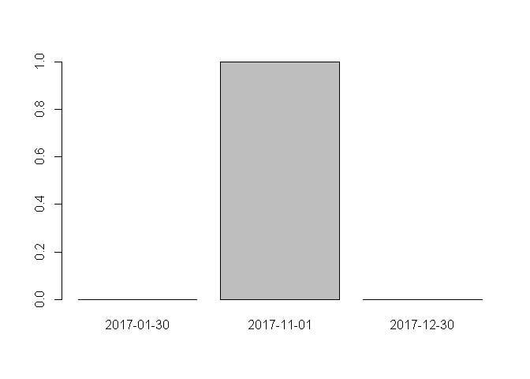<!-- -->

<h4 style="color:red;">ToDo13</h4>

```r
vect <- 1:100
for (i in 1:100) {
  if (vect[i] < 5 | vect[i] > 90) {
    vect[i] <- vect[i] * 10
  } else {
    vect[i] <- vect[i] * 0.1
  }
}
vect
```

```
##   [1]   10.0   20.0   30.0   40.0    0.5    0.6    0.7    0.8    0.9    1.0
##  [11]    1.1    1.2    1.3    1.4    1.5    1.6    1.7    1.8    1.9    2.0
##  [21]    2.1    2.2    2.3    2.4    2.5    2.6    2.7    2.8    2.9    3.0
##  [31]    3.1    3.2    3.3    3.4    3.5    3.6    3.7    3.8    3.9    4.0
##  [41]    4.1    4.2    4.3    4.4    4.5    4.6    4.7    4.8    4.9    5.0
##  [51]    5.1    5.2    5.3    5.4    5.5    5.6    5.7    5.8    5.9    6.0
##  [61]    6.1    6.2    6.3    6.4    6.5    6.6    6.7    6.8    6.9    7.0
##  [71]    7.1    7.2    7.3    7.4    7.5    7.6    7.7    7.8    7.9    8.0
##  [81]    8.1    8.2    8.3    8.4    8.5    8.6    8.7    8.8    8.9    9.0
##  [91]  910.0  920.0  930.0  940.0  950.0  960.0  970.0  980.0  990.0 1000.0
```

<h4 style="color:red;">ToDo14</h4>

```r
CalculateNewVector <- function(vx) {
  for (i in vx[1]:length(vx)) {
    if (vx[i] < 5 | vx[i] > 90) {
      vx[i] <- vx[i] * 10
    } else {
      vx[i] <- vx[i] * 0.1
    }
  }
  return(vx)
}
```

<h4 style="color:red;">ToDoFootNote</h4>

```r
CalculateNewVector <- function(vect) {
  return(ifelse((vect < 5 | vect > 90),vect*10,vect*0.1))
}
```
